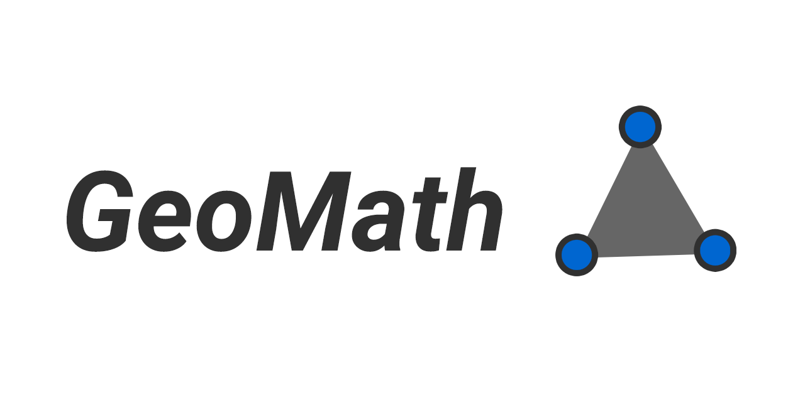

# GeoMath [](https://travis-ci.org/vmesel/GeoMath) [![PyPI version] (https://badge.fury.io/py/geomath.svg)](https://badge.fury.io/py/geomath) 

----------------------




GeoMath is a library that enables every common user that is used to Python to work with Analytical Geometry in Python 3.X. This library is free to use and open source, so you can download and use!

- Points: you can create points and calculate a ruge amount of data;
- Lines: Do you want to join two points? Add a line and envolve them;
- Figures: Do you want to create a figure with those points? Add them into a figure.

## How to Use

```
from geomath.point import Point
from geomath.line import Line
P1 = Point(0,0) # We create a Point
P2 = Point(4,4) # We create another Point
L1 = Line()
L1.create(P1,P2)
L1.equation() #it will return the line equation 
```

The library is very simple to use, the examples and usage guide are available in [GeoMath.co](http://geomath.co), and the documentation is available in [this link](https://geomath.readthedocs.io/).

## How to Install

There are two simple ways to get GeoMath installed and running on your computer:

- from Python PyPi
- from github(not recommended)

###Installing from PyPi

To install GeoMath from PyPi, first, you have to make sure that you have pip installed in your computer. With it installed, you just need to run:

``` pip install geomath ```

If everything goes fine with your installation, you just installed GeoMath and you can use it in Python.

###Installing from Github

Since GeoMath is under beta stages and during a very hard development state, installing GeoMath from it should not be a great idea. If you want to get the most stable version of the library you should install it via pip.

To install the library from Github, you must run this command:

``` git clone https://www.github.com/vmesel/GeoMath.git ```

After that, you should move GeoMath to the libraries folder in Python, so you can import it from any system.

Done! Now you can use GeoMath!

## Contributors

There are some contributors that were valuable to the project, so we need to mention them in this section.

- [Vinicius Mesel](http://www.github.com/vmesel/) - Project Maintainer
- [Wellington Santos](https://github.com/Wellington475) - Core Developer
- [Renan Palmeira](https://github.com/RenanPalmeira) - Main Debugger
- [Regis da Silva](https://github.com/rg3915) - Mathematician


##TODO

If you want to contribute, fork it into a REPO and help us develop this tool for everyone, or write an Issue so we can work on it!
